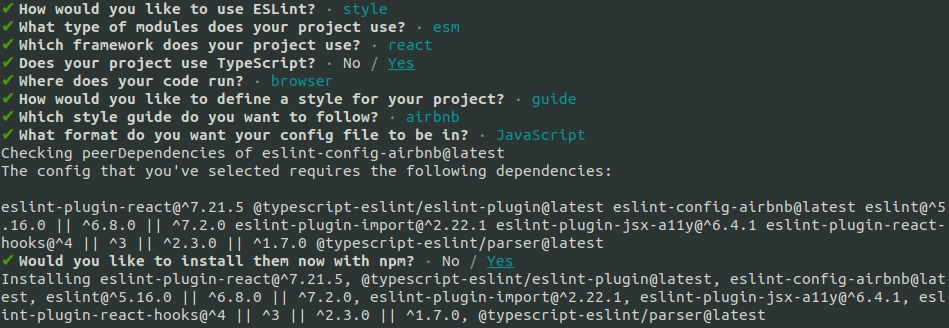

# React Typescript Boilerplate
`by: Mark Anthony Lumbao`

## ToDoS:

1. Initialize npm then install react and react-dom
    ```
    npm init -y
    npm i react react-dom
    npm i -D @types/react @types/react-dom typescript
    ```
2. Initialize git and configure **.gitignore**
    ```
    git init
    ```
    ***gitignore content:***
    ```
    node_modules
    public
    ```
3. Setup recommended src folders
    ```
    src
      - app           // not present in my code
      - assets        // not present in my code
      - components    // not present in my code
      - containers    // not present in my code
      - providers     // not present in my code
      - index.tsx     // webpack entry
      - template.html // html-webpack-plugin template
    ```
4. Setup Webpack
    * Prerequisites
      ```
      npm i -D webpack webpack-cli ts-node @types/node @types/webpack webpack-dev-server tsconfig-paths cross-env
      ```
    * Babel
      ```
      npm i -D @babel/core @babel/preset-env @babel/preset-typescript @babel/preset-react
      ```
    * Loaders
      ```
      npm i -D babel-loader css-loader style-loader
      ```
    * Plugins
      ```
      npm i -D html-webpack-plugin clean-webpack-plugin
      ```
    * Create **webpack-tsconfig.json** file
      ```
      {
        "compilerOptions": {
          "module": "commonjs",
          "target": "es5",
          "esModuleInterop": true
        }
      }
      ```
    * Create **webpack-config.ts** file
      ```
      import HtmlWebpackPlugin from 'html-webpack-plugin';
      import { Configuration } from 'webpack';

      const babelOptions = ({
        presets: [
          '@babel/preset-env',
          '@babel/preset-react',
          '@babel/preset-typescript',
        ],
      })

      const devServer = ({
        contentBase: `${__dirname}/public`,
        compress: true,
        publicPath: '/dist/',
        port: process.env.PORT || 1234,
        writeToDisk: true,
        historyApiFallback: true,
        overlay: {
          errors: true,
          warnings: true,
        },
        open: true,
      });

      const config: Configuration & { devServer: typeof devServer } = ({
        entry: `${__dirname}/src/index.tsx`,
        output: {
          path: `${__dirname}/public`,
          filename: '[id][hash].js',
          chunkFilename: '[chunkhash].js'
        },
        module: {
          rules: [
            {
              test: /\.(ts|js)x?/,
              exclude: /node_modules/,
              loader: 'babel-loader',
              options: babelOptions,
            },
            {
              test: /\.(sc|c)ss$/,
              use: [
                'css-loader',
                'style-loader',
              ],
            }
          ],
        },
        resolve: {
          extensions: ['.ts', '.tsx', '.js', ',jsx'],
        },
        plugins: [
          new HtmlWebpackPlugin({
            title: 'React TS',
            template: `${__dirname}/src/template.html`,
            minify: true,
          }),
          new CleanWebpackPlugin(),
        ],
        devServer,
      });

      export default config;
      ```
5. Add Build and Development Starter scripts in **package.json**
    ```
    "scripts": {
      "build": "cross-env TS_NODE_PROJECT=\"webpack-tsconfig.json\" webpack --mode production",
      "start:dev": "cross-env TS_NODE_PROJECT=\"webpack-tsconfig.json\" webpack serve --hot --progress --mode development"
    },
    ```
6. Create your webpack template file: **src/template.html**
    ```
    <!DOCTYPE html>
    <html lang="en">
    <head>
      <meta charset="UTF-8">
      <meta http-equiv="X-UA-Compatible" content="IE=edge">
      <meta name="viewport" content="width=device-width, initial-scale=1.0">
      <title>React TS</title>
    </head>
    <body>
      <div id="root"></div>
    </body>
    </html>
    ```
7. Create your app root file: **src/index.tsx**
    ```
    import React from 'react';
    import { render } from 'react-dom';

    render(
      <div>React TS</div>,
      document.getElementById('root'),
    );
    ```
8. Setup and Configure ESLint
    ```
    npm i -D eslint
    npx eslint --init
    ```
    

    Add the following script in the rules section of your **.eslint.js**
    ```
    'react/jsx-uses-react': 'off',
    'react/react-in-jsx-scope': 'off',
    'no-use-before-define': 'off',
    '@typescript-eslint/no-use-before-define': ['error'],
    'no-console': [
      1,
      {
        allow: [
          'error',
        ],
      },
    ],
    'import/no-extraneous-dependencies': [
      2,
      {
        devDependencies: true,
      },
    ],
    'react/jsx-filename-extension': [
      2,
      {
        extensions: [
          '.js',
          '.ts',
          '.tsx',
        ],
      },
    ],
    'import/no-anonymous-default-export': [
      'error',
      {
        allowArray: true,
        allowArrowFunction: false,
        allowAnonymousClass: false,
        allowAnonymousFunction: false,
        allowCallExpression: true,
        allowLiteral: false,
        allowObject: false,
      },
    ],
    'import/extensions': [
      2,
      'ignorePackages',
      {
        js: 'never',
        ts: 'never',
        tsx: 'never',
      },
    ],
    'import/no-self-import': 0,
    'react/jsx-fragments': [
      2,
      'element',
    ],
    'react/no-array-index-key': 0,
    'react/jsx-props-no-spreading': 0,
    '@typescript-eslint/no-unused-vars': [
      2,
      {
        args: 'none',
      },
    ],
    'no-useless-constructor': 0,
    'no-await-in-loop': 'off',
    '@typescript-eslint/no-useless-constructor': 'error',
    ```
9. Finally `npm run start:dev` command for development mode or `npm run build` for building production mode.


## Help

For any questions contact me through [markanthonylumbao@gmail.com](mailto:markanthonylumbao@gmail.com).

[](https://www.buymeacoffee.com/mark.lumbao)